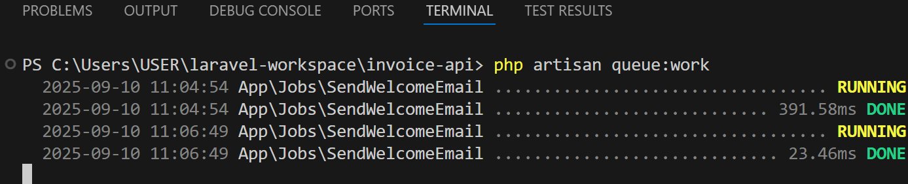

### Task & Activities

### PHP 8.1.0

### Laravel Framework 10.48.29

### September 8, 2025 - Laravel Testing with PHPUnit/Pest (Auth + CRUD)

1. API tests with PHPUnit or Pest (Auth + CRUD)

-   Create project Invoice API
-   Can create customer & issue an invoices
-   Implement PHPUnit testing

2. Setup

-   ✅ Compose new laravel project Invoice API
-   ✅ Update .env file logging & database
-   Generate app key: `php artisan key:generate`
-   Created new file in the root `.env.testing`
-   ✅ create new database `invoice_api_db`
-   ✅ Compose sanctum authentication `composer require laravel/sanctum`
-   In app\Http\kernel.php at API un comment `\Laravel\Sanctum\Http\Middleware\EnsureFrontendRequestsAreStateful::class`
-   ✅ Create Model, Controller, Request,
-   ✅ Create Model Class
-   Customer model `php artisan make:model Customer -m`
-   Invoice model `php artisan make:model Invoice -m`
-   Setup Migration files in `invoice-api\database\migrations user, customer, invoice`
-   Migrate setup files `php artisan migrate `
-   Setup models $fillables & relationships
-
-   ✅ Create Controller Class
-   Customer controller `php artisan make:controller Api\V1\CustomerController --api`
-   Invoice controller `php artisan make:controller Api\V1\InvoiceController --api`
-   User controller `php artisan make:controller Api\V1\UserController --api`
-   Auth Controller `php artisan make:controller Api\V1\AuthController`
-   Setup controllers function
-   ✅ Create Resource Class
-   Customer Resource `php artisan make:resource V1\CustomerResource`
-   Add invoices
-   Invoice resource `php artisan make:resource V1\InvoiceResource`
-   User resource `php artisan make:resource V1\UserResource`
-   Setup resources display
-   ✅ Create Request Class
-   Store User `php artisan make:request V1\StoreUserRequest`
-   Update User `php artisan make:request V1\UpdateUserRequest`
-   Store customer request `php artisan make:request V1\StoreCustomerRequest`
-   Update customer request `php artisan make:request V1\UpdateCustomerRequest`
-   Store invoice request `php artisan make:request V1\StoreInvoiceRequest`
-   Update invoice request `php artisan make:request V1\UpdateInvoiceRequest`
-   Register request `php artisan make:request V1\RegisterRequest`
-   Setup request
-   Login request `php artisan make:request V1\LoginRequest`
-   ✅ Create Seeder Class
-   User seeder `php artisan make:seeder UserSeeder ` - Create admin default user
-   Customer seeder `php artisan make:seeder CustomerSeeder`
-   Invoice seeder `php artisan make:seeder InvoiceSeeder `
-   ✅ ROUTES
-   Create route prefix
-   Create route + middleware with Authentication of Sanctum
-   Add routes of auth controller: register, login, logout
-   Add routes for User, Customer, & Invoice Controller

3.  TEST: https://laravel.com/docs/12.x/testing

-   PHPUnit and Pest are testing frameworks for PHP, and Laravel supports both.
    But they have some key differences in style, readability, and developer experience.
-   `PHPUnit is a unit testing framework for PHP and Laravel provides a seamless way to use it for testing your API`

-   Setup
-   ✅ Duplicate `.env` file and rename it into `.env.testing`
-   Create test database `invoice_api_db_test` & Update database name
-   Clear Caches: It's good practice to clear caches before testing. `php artisan config:clear` & `php artisan cache:clear`
-   Run Migrations: Run the migrations to set up the test database. `php artisan migrate --env=testing`
-   Create a Test File `php artisan make:test UserApiTest` This command will create a new file at tests/Feature/UserApiTest.php. Feature tests are ideal for API testing as they test a larger portion of your application, including routing and controllers.
-   Command Test for Feature only `php artisan test --testsuite=Feature --stop-on-failure`
-   Use Traits: Open tests/Feature/UserApiTest.php and add the `RefreshDatabase` and `WithoutMiddleware` traits.
-   `RefreshDatabase:` This trait automatically migrates your test database before each test and rolls back the migrations after. It ensures that each test method runs on a clean, blank database.
-   `WithoutMiddleware:` This trait disables all middleware for your test. This is useful for isolating your tests from things like CSRF protection, allowing you to focus on the core logic.

-   Specific function `php artisan test --filter=a_user_can_retrieve_their_own_profile`

-   ✅ Others
-   Creating test file in unit `php artisan make:test UserTest --unit`
-   Command to run the test `php artisan test`
-   Command Test for Unit only `php artisan test --testsuite=Unit --stop-on-failure`

### September 9, 2025 - Pagination, Sort, Filtering, & Search with Optional

1. Pagination - controls how many results.

-   eloquent’s built-in pagination

-   `$users = User::paginate(10);` // standard pagination
-   `$users = User::simplePaginate(10);` // lightweight pagination
-   `$users = User::cursorPaginate(10);` // best for large tables

-   End point `/api/v1/customers?page=1&per_page=5`
-   End point `/api/v1/customers?type=individual&sort=name&page=2&per_page=10&include_invoices=true`
-

2. Sort - orders the results.

-   ?sort=-id //descending order
-   ?sort=od //ascending order
-   `{{baseURL}}/api/v1/customers?type=business&sort=-id&page=1&per_page=10&include_invoices=false`

3. Filter - limits results by type, status

-   ?type=business //or individual
-   `{{baseURL}}/api/v1/customers?type=business&page=1&per_page=10&include_invoices=false`

4. Search - finds model (ex. customers) by keyword.

-   `{{baseURL}}/api/v1/customers?q=jo`

5. Optional - includes let you decide whether to fetch related data (invoices).

### September 10, 2025

### File Upload + Storage (e.g., User Attachments)

1. Basic file upload

-   Make a File model `php artisan make:model File -m`
-   Make a FileUploadController - `php artisan make:controller Api\V1\FileUploadController`
-   In FileUploadController created a functions
-   Single upload file
-   Multiple file upload
-   Created routes for single & multiple upload
-   Stored the files in `storage\app\public\uploads`
-   Save file name & path in the database `files table`

### Queues (Jobs for email / async tasks)

1. In Laravel, Queues (also called Jobs) are a way to run time-consuming tasks in the background instead of making the user wait for them to finish during a web request
2. Queues in Laravel: Main Things You Need to Know (Two Examples): `https://www.youtube.com/watch?v=D5tr7r2_i7E`
3. Queues (Jobs for Email) for User Registration

-   Update `.env property QUEUE_CONNECTION from sync to database `
-   Update `MAIL_MAILER=log #smtp`
-   Create Jobs table `php artisan queue:table` then `php artisan migrate`
<?php
-   Create a Mailable - send an email when a user registers (as an example). `php artisan make:mail WelcomeMail` this creates to `app\Mail\WelcomeMail.php`
-   Update the WelcomeMail.php add $user in the constructor & build() function
-   Create a view file in `resources/views/emails/welcome.blade.php`
-   Create a Job `php artisan make:job SendWelcomeEmail` creates to `app/Jobs/SendWelcomeEmail.php`
-   Update SendWelcomeMail add protected $user, constructor, & handle mail to
-   Dispatch Job in Controller in UserController - add dispatch after creating a user `SendWelcomeEmail::dispatch($user);`
-   Run Queue Worker - start the worker to process jobs `php artisan queue:work`
-   
-   After user registered can see the email content here `storage/logs/laravel.log`
-   Note: Email written in the log file
-   Running Serve & Queues In production use `Supervisor (Production)` through `Nginx/Apache`
-   In local development just open 2 terminal One for `php artisan serve` & `php artisan queue:work`

### September 11, 2025 - Swagger / OpenAPI docs generation

1. Swagger (Zircote) Setup

-   Install Swagger-PHP Library in terminal enter the command `composer require zircote/swagger-php`
-   Create API routes `/customers`
-   Create swagger annotations in controller methods to document the API `@SWG`
-   After annotating controllers, generate swagger documentation
-   Install the package for v8 `composer require "darkaonline/l5-swagger:^8.0"` for v9+`composer require darkaonline/l5-swagger`
-   Publish the swagger configuration `php artisan vendor:publish --provider "L5Swagger\L5SwaggerServiceProvider"`
-   Didn't proceed due to Php version 8.1.0 & the l5-swagger is v9 and not compatible

2. Scramble – Laravel OpenAPI (Swagger) Documentation Generator `https://scramble.dedoc.co/`

-   Scramble installation https://scramble.dedoc.co/installation
-   Install Scramble: `composer dedoc/scramble`
-   Check the scramble api routes `php artisan route:list`
-   Routes added: `/docs/api` & `/docs/api.json`
-   Next Pubshing Config `php artisan vendor:publish --provider="Dedoc\Scramble\ScrambleServiceProvider" --tag="scramble-config"` folder `config\scramble.php`
-   Allow access in `App\Providers\AppServiceProvider` in `boot()` (REMOVED)
-   `Dedoc\Scramble\ScrambleServiceProvider::class` // register scramble provider config/app.php
-   Removing scramble `composer remove dedoc/scramble`

3. Scribe - https://scribe.knuckles.wtf/laravel/

-   Add package `composer require knuckleswtf/scribe`
-   Publish the config file `php artisan vendor:publish --tag=scribe-config` then will create a scribe.php file in your config folder
-   Configure `config/scribe.php`
-   Type Laravel
-   Routes (use default)
-   Responses replace into no examples `'responses' => removeStrategies(Defaults::RESPONSES_STRATEGIES, [Strategies\Responses\ResponseCalls::class,]),`
-   Note: auto generated response cause the slowness of generating api docs
-   Test run in terminal enter the cmd: `php artisan scribe:generate`
-   Show info `composer show knuckleswtf/scribe` (optional)
-   Update scribe `composer update knuckleswtf/scribe` (optional)
-   After generating the documents resources `resources\views\scribe\index.blade.php` & public folder updated `public\vendor\scribe`
-   Run the `php artisan serve` then access the api docu `http://127.0.0.1:8000/docs`
-   Remove scribe `composer remove knuckleswtf/scribe`
-   Delete scribe config `rm config/scribe.ph`or `Remove-Item C:\Users\USER\laravel-workspace\invoice-api\config\scribe.php`
-   Remove scribe assets
-   Public folder `Remove-Item -Recurse -Force public\vendor\scribe`
-   Resources folder `Remove-Item -Recurse -Force resources\views\scribe`
-   Clear Laravel caches - config, route, cache, & `composer dump-autoload`

### Sept. 12, 2025

4. Swagger (g4t/swagger) Laravel Autogenerate Package

-   Link `https://github.com/hussein4alaa/laravel-g4t-swagger-auto-generate/`
-   Documentation: `https://swagger.io/docs/`
-   Installation
-   a. Install the Swagger Laravel Autogenerate Package via Composer: `composer require g4t/swagger` - Using version ^4.0 for g4t/swagger
-   b. After installing the package, publish the configuration file: `php artisan vendor:publish --provider "G4T\Swagger\SwaggerServiceProvider"`
-   Swagger config `config\swagger.php`
-   Swagger public folder `public\g4t\swagger`
-   c. Access swagger documentation:
-   Documentation: `http://127.0.0.1:8000/swagger/documentation`
-   Issues: `http://127.0.0.1:8000/swagger/issues`
-   d. Include description, summary, & hide endpoint:
-   In routes add description: ` Route::get('user', [UserController::class, 'index'])->description('Get list of users with pagination.');`
-   In routes add summary `Route::get('user', [UserController::class, 'index'])->summary('get users.');`
-   In routes add hide enpoint `Route::get('user', [UserController::class, 'index'])->hiddenDoc();`
-   e. Section description
-   `#[SwaggerSection('everything about your users')] class UserController extends Controller { // functions }`
-   f. Enable documentation auth, open config/swagger.php and edit:
-   "enable_auth" => false, //make this true
-   "username" => "admin",
-   "password" => "pass",
-   "sesson_ttl" => 100000,

-   REMOVAL
-   Swagger g4t open doc api: composer remove g4t/swagger
-   Config file `rm config/swagger.php`

### September 12, 2025 - Laravel Service Layer

1.  Service Layer Design Pattern in Laravel (PHP) written by Mohammad Rashandelpoor Software Engineer | Laravel | PHP | Nuxt | Vue | with over 10 years of experience, have a deep understanding of software architecture `https://medium.com/@mohammad.roshandelpoor/service-layer-design-pattern-in-laravel-php-e132dcb4c2ab`

2.  Set Up Services

-   App > Create Services folder: `mkdir app/Services`
-   Create Services for Business logic
-   UserService Class `New-Item -Path "app/Services/UserService.php" -ItemType File`
-   AuthService Class `New-Item -Path "app/Services/AuthService.php" -ItemType File`
-   App > Create Repositories folder `mkdir app/Repositories`
-   Create Repositories - class will contain methods for querying and manipulating model data in the database
-   UserRespository Class `New-Item -Path "app/Repositories/UserRepository.php" -ItemType File`
-   Setup `UserRepository` class database operations
-   Setup `AuthService` business/authentication logic
-   Update `AuthController` update incoming request/response & validation
-   Implemented database operation on `UserRepository`
-   Implemented business login on `AuthService` & inject `UserRepository`
-   Updated `AuthController` validation & handle request & response. Inject the `AuthService`
-   Run the Serve in first terminal: `php artisan serve`
-   Run the Queue Work in second terminal: `php artisan queue:work`
-   Test registration in `Postman`

### September 16, 2025 - Error Tracking & Notifications

1. Error Tracking - (6hrs) Duration

-   Use Try & Catch (with ValidationException & ModelNotFoundException) and Log
-   Code Refactor & Implement Service layer to Customer
-   Best practice: Implemented logs in service layer (CRUD functions) & keep the controller thin
-   Implement global exception for handling not found

-   # Sentry > Monitoring & Error tracking `https://medium.com/@mohammad.roshandelpoor/monitoring-and-error-tracking-in-laravel-59c31b985c0d`

2. Notification (2hrs)

-   Email notification using mailtrap.io
-   Open `.env file` update the MAIL CONFIG copy the values from mailtrap > sandbox smtp credentials
-   MAIL_MAILER=smtp
-   MAIL_HOST=sandbox.smtp.mailtrap.io
-   MAIL_PORT=2525
-   MAIL_USERNAME=f6abc4
-   MAIL_PASSWORD=32bc56
-   MAIL_ENCRYPTION=tls
-   MAIL_FROM_ADDRESS="mr.catalla28@gmail.com"
-   MAIL_FROM_NAME="${APP_NAME}"

### September 17, 2025 - Third-Party API integration (Payment gateway & SMS providers)

1. Scramble Open API Doc

-   Install `composer require dedoc/scramble`
-   Run serve `php artisan serve`
-   Enter the url to access generated API Doc by Scramble `http://127.0.0.1:8000/docs/api`
-   Json doc format `http://127.0.0.1:8000/docs/api.json`
-   scramble config file `php artisan vendor:publish --provider="Dedoc\Scramble\ScrambleServiceProvider" --tag="scramble-config"` - loc. `config\scramble.php`
-   Update the config changes, rebuild docs: `php artisan scramble:analyze`
-   Run `php artisan serve`
-   Publish scramble ui
-   `php artisan vendor:publish --tag="scramble-views"` - resources\views\vendor\scramble
-   remove config file `rm config/scramble.php`

2. Payfusion API integration

-   # Created Payfusion Merchant Account: `https://payfusion.solutions/`
-   # Developers:
-   a. API Docs
-   b. Generate an API Key (will be used in .env file)
-   c. Webhooks
-   Integrate Payfusion in Laravel API Project
-   # Add Payfusion Credentials in `.env file`:
-   Payfusion Payment Integration
-   PAYFUSION_API_KEY=CvFLKK3g8i2WcLMJBCXQZ\***\*\*\*\*\*\***
-   PAYFUSION_MODE=sandbox # or live
-   PAYFUSION_BASE_URL=https://payfusion.solutions/api
-   # Create a Config File in `config/services.php`
-   'payfusion' => [
-   'key' => env('PAYFUSION_API_KEY'),
-   'mode' => env('PAYFUSION_MODE', 'sandbox'),
-   'base_url' => env('PAYFUSION_BASE_URL', 'https://payfusion.solutions/api/v1'),
-   ],
-   # Create PayfusionService Class `New-Item -Path "app/Services/PayfusionService.php" -ItemType File`
-   In payfusion service inject the payfusion from config > services.php
-   Create a constructor and inject the config
-   Create Services Implements for Header, Token, Payment, & Invoice
-   # Create PayfusionController Class `php artisan make:controller Api\V1\PayfusionController`
-   Create Controller function
-   Create Requests Class for Token, Payment, & Invoice - for validation
-   Test Get List of Invoices

### September 18, 2025 - Cont. Payfusion API integration

-   Payfusion requires an Idempotency-Key header on payment request calls (to prevent duplicate charges if a request is retried).
-   In PayfusionService Add Idempotency-Key Header `'Idempotency-Key' => $idempotencyKey ?? (string) Str::uuid(),`
-   createPaymentRequest() // generate UUID v4 for idempotency key (next to url)
-   Can create invoice, get invoice by id, & get list of invoice

-   # Note: Need to create a Merchant Account

### September 19, 2025 - Third-Party API integration SMS SMS Gateway

1. M360: `https://www.m360.com.ph/`

-   Note: Need to communicate with sales

2. Semaphore Sms gateway `https://semaphore.co/`

-   Note: No free messages, need to buy credits for testing

3. Infobip `https://www.infobip.com/`

-   Infobip API PHP Client `https://github.com/infobip/infobip-api-php-client`
-   Install SDK `composer require infobip/infobip-api-php-client:^4.0`

-   ## Add Infobip Credentials in `.env file`
-   INFOBIP_API_KEY=67ac96be4b0ec09ad53a45c4621b82ee-10fe3b30-**\*\***
-   INFOBIP_BASE_URL=**\*\***.api.infobip.com
-   INFOBIP_SENDER=NBJamer

-   ### Configure config > services.php
-   'infobip' => [
-   'key'=> env('INFOBIP_API_KEY'),
-   'base_url' => env('INFOBIP_BASE_URL'),
-   'sender'=> env('INFOBIP_SENDER'),
-   ],

-   Create InfoBipSmsService Class
-   ### Add new service `New-Item -Path "app/Services/InfoBipSmsService.php" -ItemType File`
-   Add constructor, send fxn, & format local number fxn
-   Create SmsController Class
-   `php artisan make:controller Api\V1\SmsController`
-   Update `routes > api.php` add post method for SmsController send()
-   Terminal... `Optimize & Serve`

### summary

-   .env → stores credentials
-   config/services.php → central config registry
-   InfobipService → service layer
-   SmsController → API controller
